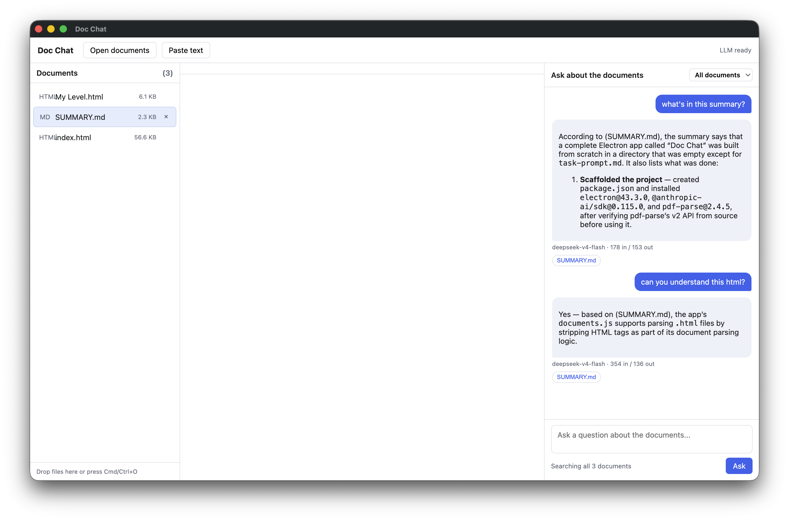
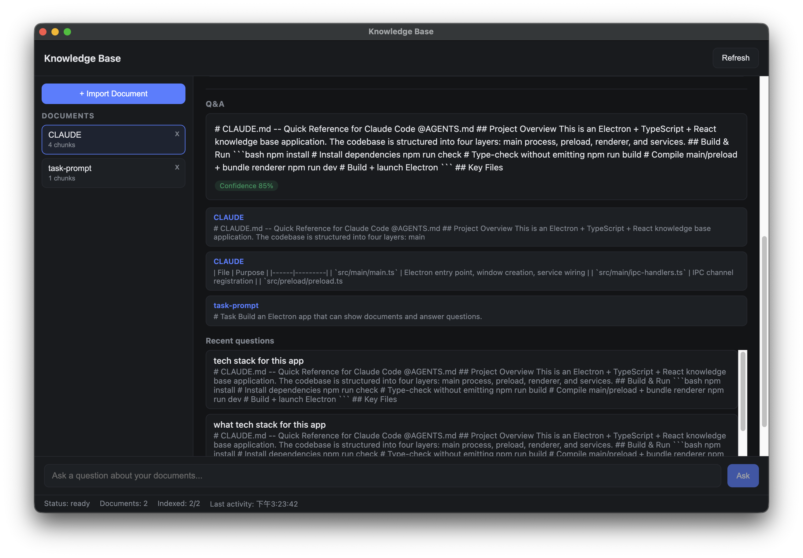

# Project 01: Baseline vs Minimal Harness

Project 01 builds the same Electron app twice - a document-driven knowledge
base that shows files and answers questions about them - to compare two
working styles: a **weak harness** (plain JS, no structure or tests) and a
**strong harness** (TypeScript, architecture rules, a test suite).

## Contents

- [weak-harness - Doc Chat](#weak-harness)
- [strong-harness - TypeScript + React knowledge base](#strong-harness)
- [Takeaways](#takeaways)

<h2 id="weak-harness">weak-harness - "Doc Chat"</h2>

A plain-JavaScript Electron app with a three-pane UI (document list / markdown
preview / chat). Built in a ~26 min session, it works on the happy path but
ships with no tests or type safety - a follow-up review found four bugs.

### Build summary

- **UI:** streaming answers with clickable source chips, token/model metadata,
  Stop button, scope selector, drag-drop and paste-text import, and a
  self-contained XSS-safe markdown renderer.
- **Main process:** `main.js` (window, native menu, dialog / drag-drop open,
  IPC handlers) and `preload.js` (sandboxed `contextBridge` API).
- **Libraries:** `documents.js` (parses `.txt/.md/.json/.csv/.html/.pdf`,
  HTML tag stripping, 10 MB cap), `retriever.js` (~600-char chunks, lexical
  TF-IDF scoring), `qa.js` (streams answers via the Anthropic SDK).
- **Verified:** syntax checks, Node tests of parsing/retrieval (incl. a
  hand-built PDF), an Electron smoke test, and a live run.
- **Run:** `npm start`

| Metric               | Value                      |
| -------------------- | -------------------------- |
| Session duration     | 25m 54s                    |
| Total cost           | $7.28                      |
| Total code changes   | 2050 added / 154 removed   |

Chat requires `ANTHROPIC_AUTH_TOKEN` and `ANTHROPIC_BASE_URL` to be set (the
environment routes the API through a relay serving `deepseek-v4-flash`). If
they are unset, the app shows no warning - the chat window just cannot answer
and displays "No matching passages found in the loaded documents. Try loading
more documents or rephrasing the question."

### Bug report

Reviewed 2026-08-05, after two symptoms were reported: the document never
displays in the center window, and the chat stops working.

| # | Bug | Symptom | Cause | Fix |
|---|-----|---------|-------|-----|
| 1 | Center pane never renders | Document list shows, but the body stays empty | `docs:get` (`main.js:139`) omits `chars`, so `renderer.js:254` throws a TypeError on `doc.chars.toLocaleString()` | Return `chars` from the handler, or use `doc.text.length` |
| 2 | Chat dies on the second question | First question works, then a 400 error bubble | User turns are never pushed into `state.conversation`, so the API rejects a request whose first message is not `role: 'user'` | Push the user turn in `ask()` (`renderer.js:375`) |
| 3 | Chat fails on non-Latin / short questions | No answer for Chinese or stopword-heavy questions | `tokenize` matches only `[a-z0-9]+`, so retrieval returns no passages before the LLM is called | Widen the tokenizer (matters only if such questions are asked) |
| 4 | Token usage never displays (cosmetic) | "X in / Y out" line is missing | `qa.js` reads `input_tokens` from `message_delta`, which only carries `output_tokens` | Read from the correct stream event |

Priority: fix 1 and 2 first (they resolve the reported symptoms), then 3 only
if non-Latin or very short questions matter, and 4 last since it does not
affect answers.

<h2 id="strong-harness">strong-harness - TypeScript + React knowledge base</h2>

The same product rebuilt with guardrails: four strict layers, shared typed IPC
contracts, and a vitest suite. Built in ~13 min, with every check green.

### Architecture & features

- **Four layers:** `src/main` (window lifecycle, IPC registration), `src/preload`
  (the only bridge - typed `contextBridge` exposing `window.knowledgeBase`),
  `src/renderer` (React UI), `src/services` (business logic), all sharing types
  and IPC channel names from `src/shared/types.ts`.
- **Services:** `PersistenceService` (atomic JSON/text I/O), `DocumentService`
  (import/list/get/delete, 10 MB cap, `.txt/.md`), `IndexingService`
  (paragraph-aware ~500-char chunking), `QaService` (keyword retrieval with
  citations, confidence 0.85/0.30, persisted history).
- **Renderer:** dark-themed React app - `App.tsx` plus 7 components
  (`DocumentList`, `DocumentDetail`, `ImportPanel`, `QuestionPanel`,
  `QaResponse`, `StatusBar`, `Welcome`) behind a CSP meta tag.

### Verification

- `npm run check` - TypeScript strict passes
- `npm run build` - tsc + vite pass, no warnings
- `npm test` - 15/15 tests pass (chunking + import/indexing/QA services)
- `npm run dev` - Electron smoke launch, zero console errors
- `feature_list.json` - all 4 features marked `pass` with evidence

Notes: the npm allow-scripts gate blocked the electron/esbuild postinstall
scripts (binaries extracted manually, Electron 33.4.11); the renderer loads via
CSP `default-src 'self'` on `file://` without refusals.

| Metric | Value |
| ------ | ----- |
| Total usage time | 13m 16s |
| LiteLLM cost | 0.04 USD |
| Cache hit | 98.2% |
| Model | deepseek-v4-flash |

<h2 id="takeaways">Takeaways</h2>

| | weak-harness | strong-harness |
| --- | --- | --- |
| Language | plain JS | TypeScript (strict) |
| Architecture | flat files | 4 strict layers |
| Tests | ad-hoc scripts | 15 vitest tests |
| Review result | 4 bugs found | all features pass |
| Session time | 25m 54s | 13m 16s |

The strong harness produced a verified result in less time because the
structure caught mistakes as it went, instead of leaving them for a later
review. The sessions ran on different models (claude-sonnet-4-6 for the weak
harness at $7.28, deepseek-v4-flash for the strong harness at $0.04), so the
cost difference is not a direct measure of harness quality.

## Sources

- [weak-harness/SUMMARY.md](weak-harness/SUMMARY.md) - Doc Chat build log
- [weak-harness/bugs.md](weak-harness/bugs.md) - Doc Chat bug report
- [strong-harness/claude-progress.md](strong-harness/claude-progress.md) - strong-harness session log
