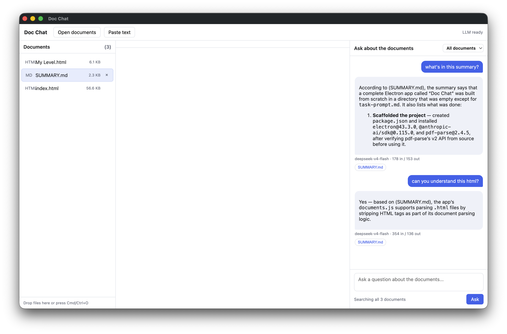
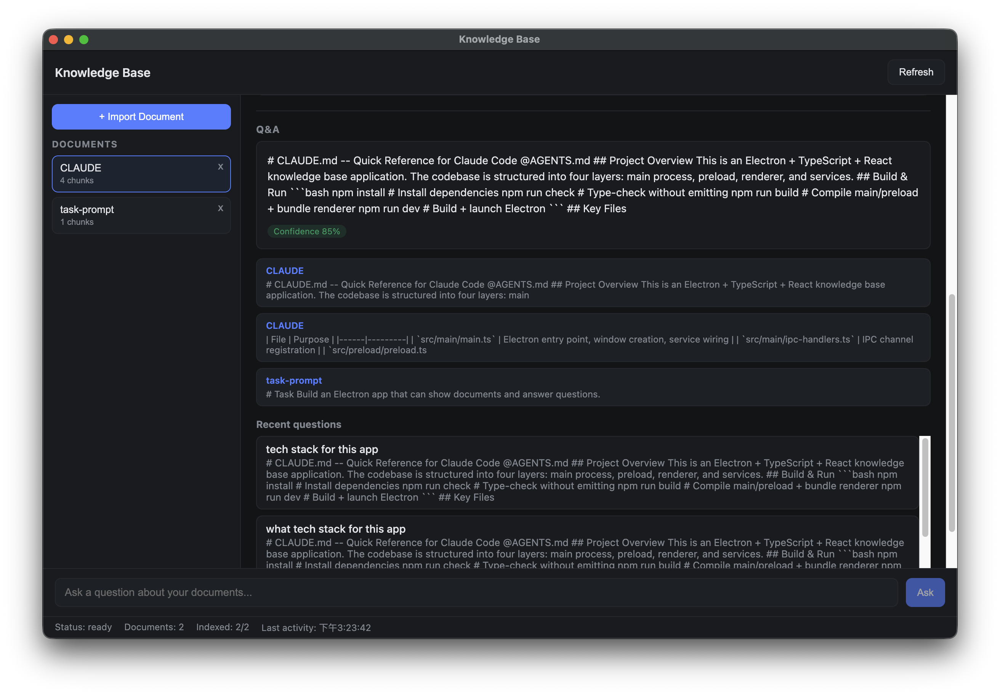

# Project 01: Baseline vs Minimal Harness

Project 01 builds the same Electron app twice - a document-driven knowledge
base that shows files and answers questions about them - to compare two
working styles: a **weak harness** (plain JS, no structure or tests) and a
**strong harness** (TypeScript, architecture rules, a test suite).

## Contents

- [Extra information: Prompt-Only vs Rules-First](#extra-information-prompt-only-vs-rules-first)
- [Cross-validation: second agent (Cowork)](#cross-validation-second-agent-cowork)
- [Weak-harness - Doc Chat](#weak-harness)
- [Strong-harness - TypeScript + React knowledge base](#strong-harness)
- [Takeaways](#takeaways)

## Extra information: Prompt-Only vs Rules-First

> Extra information: the two-run experiment protocol, plus the gaps and
> inaccuracies in the
> [course project page](https://walkinglabs.github.io/learn-harness-engineering/en/projects/project-01-baseline-vs-minimal-harness/)
> that I filed in [PR #61](https://github.com/walkinglabs/learn-harness-engineering/pull/61).
> Standalone copy: [p01-share-README.md](p01-share-README.md).

Compare how much of the same Electron knowledge-base task a coding agent completes
when given only a prompt vs. a minimal harness.

Two packages:
- [p01-baseline-init.tar.gz](p01-baseline-init.tar.gz): weak harness. Only `task-prompt.md`.
- [p01-improved-init.tar.gz](p01-improved-init.tar.gz): strong harness. Contains `AGENTS.md`, `CLAUDE.md`,
  `init.sh`, `feature_list.json` (schema preserved with empty values),
  `claude-progress.md` (title only), `docs/`, and `task-prompt.md`.

Both packages are derived from the repo's checked-in `starter/` and `solution/`,
with the app source excluded so the agent must build it from scratch in both
runs. The checked-in `starter/` already contains the finished app, so handing it
to the agent as-is would measure nothing.

The four features the harness measures (from `solution/feature_list.json`):
window launch, document list panel, question panel, and local data directory
creation.

### Isolation rule (read first)

The comparison is only valid if the two runs never see each other. A coding agent
has full filesystem access and will explore sibling directories and git branches.

1. Extract and run ONE package at a time.
2. Never extract both into the same folder, or into sibling folders, while a run
   is in progress.
3. After a run, archive the results, then delete the folder before the other run.
4. Do not make a git repo that contains both runs (as directories or branches).
   The agent will find the other run and the weak-harness test is contaminated.
   The course suggests git branches for comparing runs; this package avoids git
   entirely because an agent may explore branch refs. If you do use branches,
   keep one working directory and never check both out as siblings.

### Task prompt (identical for both runs)

> Build an Electron app that can show documents and answer questions.

### Clarifying questions during the runs

The course docs don't state whether the agent may ask clarifying questions, and it
happens anyway: in practice a weak-harness agent asked about document formats, tech
stack, and Q&A scope before writing any code.

The rule that keeps the comparison valid:

- The agent asking is fine. It is the agent's own autonomous behavior under the
  prompt. Record what it asked as experimental data.
- The operator answering with scope decisions is not: choosing "text + PDF +
  images", "Electron Forge + React", or "Claude Q&A grounded in the open document"
  injects external spec into the run. That is exactly the guidance the weak harness
  is meant to measure the absence of, and it breaks the "same task twice"
  comparison.
- If the agent asks, reply "use your best judgment" (or don't answer), and record
  the questions. Let it build to its own defaults.
- Subtler leak: with `AskUserQuestion`, the multiple-choice options are written by
  the agent, so they carry the agent's own priors (pdf.js, Forge, open-document
  QA). Even in a prompt-only run, answering nudges the outcome toward the agent's
  assumptions. Refusing to answer removes the nudge.
- To test pure autonomy instead, one line may be added to the task prompt: "Do not
  ask clarifying questions; assume sensible defaults and build." This adds no
  harness files, so the run remains prompt-only. Pick either approach, but use the
  SAME prompt for both runs.

### Prerequisites

- Claude Code, Codex, or GitHub Copilot (use the same one for both runs)
- Node.js + npm
- A timer, or AgentsView instead. It records tool-call time, token usage, and the
  agent's thinking per run, which gives better stats than a stopwatch.

### Run A: weak harness

1. `mkdir p01-a && cd p01-a`
2. `tar xzf ../p01-baseline-init.tar.gz`
3. Launch the agent in `p01-a`, paste the task prompt, start the timer.
4. When it stops, try `npm start` (or whatever it produced). If it doesn't
   launch, record that. Do NOT fix it.
5. Record: first-successful-launch time, retries, missing features, premature
   stop, the agent's final summary, key diff.
6. `zip -r ../p01-a-results.zip . && cd .. && rm -rf p01-a`

### Run B: strong harness

1. `mkdir p01-b && cd p01-b`
2. `tar xzf ../p01-improved-init.tar.gz`
3. Launch the agent, paste the SAME prompt, same timer as Run A.
4. When it stops, run `bash init.sh`. Record the result.
5. Confirm the app launches with `npm run dev` (the harness pins this command).
6. Check `feature_list.json`: which features are `"pass"`, and did the agent
   flip them itself?
7. Record the same metrics as Run A, then archive and delete.

### Compare

| Metric | A (weak) | B (strong) |
|---|---|---|
| Result (complete / partial / failed) | | |
| First successful launch | | |
| Retries / human interventions | | |
| Missing features at "done" | | |
| Premature stop | | |

Write a 1-2 page note: what differed, the data, your conclusion.

### Results are data, not verdicts

The English page is explicit: "This is a comparison experiment, not a requirement
that both agent runs produce a production-ready Electron app. Partial or broken
output is valid experimental evidence." A weak run that fails to launch is still
a valid data point. Record it, do not fix it or restart it.

### Claude Code and AGENTS.md

Claude Code auto-loads `CLAUDE.md`, not `AGENTS.md` (per the Claude Code memory
docs). The checked-in `solution/CLAUDE.md` is only a quick reference. It lacks
the startup rules, the `docs/` references, the Definition of Done, and the
`feature_list.json` status semantics that live in `AGENTS.md`. So for a Claude
Code run, the harness is weaker than for Codex or Copilot, which auto-load
`AGENTS.md`. Both `p01-improved-init.tar.gz` and the PR fix this: `CLAUDE.md`
starts with `@AGENTS.md`, importing the full spec.

The import also duplicates CLAUDE.md's four "Architecture Rules" (they already
live in AGENTS.md). That is a small token waste, but the copies agree, so it
does not affect the harness test result. Future cleanup: rewrite `CLAUDE.md` as
a reference derived from `AGENTS.md` instead of re-stating its rules.

### Course docs inconsistencies

These packages are self-contained. If the published course docs disagree with
them, trust the packages. All three gaps below were filed as a single PR and
merged upstream - see [Filed as PR #61](#filed-as-pr-61-merged-2026-08-06).

- **`docs/` is missing from the harness description.** The [English project page](https://walkinglabs.github.io/learn-harness-engineering/en/projects/project-01-baseline-vs-minimal-harness/) lists the strong-harness artifacts as `AGENTS.md`, `CLAUDE.md`, `init.sh`, `feature_list.json`, `claude-progress.md` and defines the harness as "AGENTS.md + init.sh + feature_list.json". Neither mentions `docs/`. But `solution/AGENTS.md` steps 2-3 order the agent to read `docs/ARCHITECTURE.md` and `docs/PRODUCT.md`, so they must be included or the strong run stalls. `p01-improved-init.tar.gz` includes them.
- **The zh-TW page adds a 30-min / 20-round limit the English page lacks.** The [zh-TW page](https://walkinglabs.github.io/learn-harness-engineering/zh-TW/projects/project-01-baseline-vs-minimal-harness/) has a "具體步驟" section that caps each run at "建議 30 分鐘 / 20 輪" and lists metrics and deliverables; the [English page](https://walkinglabs.github.io/learn-harness-engineering/en/projects/project-01-baseline-vs-minimal-harness/) has no steps section or limits at all, and adds a note that partial or broken output is valid experimental evidence, which the zh-TW page lacks. This README follows the English page and prescribes no time or round limit.
- **The zh-TW page mis-describes `init.sh`.** The [zh-TW page](https://walkinglabs.github.io/learn-harness-engineering/zh-TW/projects/project-01-baseline-vs-minimal-harness/) calls it "一鍵恢復可執行狀態（`npm install && npm start`）" (one-click restore to a runnable state). The actual `init.sh` runs `npm install` + `npm run check` + `npm run build`; it verifies the project builds and never launches the app. `npm start` isn't even a defined script in the checked-in `package.json` (the launch script is `npm run dev`).

### Filed as PR #61 (merged 2026-08-06)

The gaps above were filed as
[PR #61](https://github.com/walkinglabs/learn-harness-engineering/pull/61)
and merged into `walkinglabs/learn-harness-engineering` on 2026-08-06.
What the merged PR changed:

- **`solution/CLAUDE.md`** now starts with `@AGENTS.md`, so Claude Code loads the
  full harness spec (startup rules, `docs/` references, Definition of Done,
  `feature_list.json` status semantics). The two-file shape is kept for
  Codex/Copilot, which auto-load `AGENTS.md`.
- **`docs/en/.../index.md`**:
  - marks the intro artifact list as a subset (`e.g.`) so it no longer
    contradicts the six-artifact "Harness Mechanism" line;
  - notes `starter/` contains a reference implementation that must be stripped
    before the run, and that `data/` sample docs are the reader's call;
  - links `docs/` and adds reset-evidence guidance (statuses to `not-started`,
    clear `evidence`/`testedAt`, clear `claude-progress.md` log);
  - replaces the git-branch comparison with isolated working directories;
  - gains the Run Protocol / How to Measure Results / What to Submit sections.
- **`docs/zh-TW/.../index.md`**: same fixes, plus removal of the 30-min/20-round
  limit (the English page never had it) and a corrected `init.sh` description
  (`npm install && npm run check && npm run build` - it verifies the build and
  never launches the app).

Closed loop: the experiment surfaced the doc gaps, the gaps were filed and
merged upstream, and the course pages now match the protocol these packages
already shipped with.

<h2 id="cross-validation-second-agent-cowork">Cross-validation: second agent (Cowork)</h2>

> Standalone copy: [p01-cowork-cross-validation.html](p01-cowork-cross-validation.html).

The same protocol was run a second time by a different agent (**Cowork**, an
OpenWorker agent, 2026-08-09) - same task prompt, same harness files. The gap
reproduced: the strong run finished in about half the time with all checks
green and zero post-hoc bugs, while the weak run needed 3 launch-fix rounds
(electron install, path.txt, sandboxed preload) before it worked.

This second run is a **lower bound** - the agent had read `solution/` and
carries its own built-in harness - so the Claude Code numbers above remain the
cleaner estimate. Shared finding that reproduced: npm's allow-scripts gate
blocked the electron/esbuild postinstall in *both* agents' runs, an
environment-level issue no harness file fixes.

**Why this happens (condensed).** npm 11.16+ silently skips any dependency's
`postinstall`/`preinstall` script that isn't on an explicit allowlist (npm 12
turns this into a hard failure). The `electron` npm package is just a JS
wrapper - its `postinstall` downloads the real binary into
`node_modules/electron/dist/` and writes `path.txt`; skip it and launch dies
with *"Electron failed to install correctly"*. No harness file can fix this:
the block lives in the package manager's security policy **on the machine**,
not in the project, and `init.sh` (build-only) never touches Electron's
binary. The fix is environment-level too:

```bash
npm approve-scripts electron esbuild   # writes pinned allowScripts entries
```

Commit the resulting `allowScripts` block + lockfile so every future clone is
fixed, and add a launch/smoke-test step to `init.sh`. Full mechanism
breakdown: [p01-cowork-cross-validation.html](p01-cowork-cross-validation.html).

<h2 id="weak-harness">Weak-harness - "Doc Chat"</h2>

A plain-JavaScript Electron app with a three-pane UI (document list / markdown
preview / chat). Built in a ~26 min session, it works on the happy path but
ships with no tests or type safety - a follow-up review found four bugs.

### Build summary

- **UI:** streaming answers with clickable source chips, token/model metadata,
  Stop button, scope selector, drag-drop and paste-text import, and a
  self-contained XSS-safe markdown renderer.
- **Main process:** `main.js` (window, native menu, dialog / drag-drop open,
  IPC handlers) and `preload.js` (sandboxed `contextBridge` API).
- **Libraries:** `documents.js` (parses `.txt/.md/.json/.csv/.html/.pdf`,
  HTML tag stripping, 10 MB cap), `retriever.js` (~600-char chunks, lexical
  TF-IDF scoring), `qa.js` (streams answers via the Anthropic SDK).
- **Verified:** syntax checks, Node tests of parsing/retrieval (incl. a
  hand-built PDF), an Electron smoke test, and a live run.
- **Run:** `npm start`

| Metric               | Value                      |
| -------------------- | -------------------------- |
| Session duration     | 25m 54s                    |
| Total cost           | $0.11                      |
| Model                | deepseek-v4-flash          |
| Total code changes   | 2050 added / 154 removed   |

<a href="weak-harness/p01-weak-harness.png" target="_blank" rel="noopener"></a>

### Bug report

Reviewed 2026-08-05, after two symptoms were reported: the document never
displays in the center window, and the chat does not reply to a question.

Chat requires `ANTHROPIC_AUTH_TOKEN` and `ANTHROPIC_BASE_URL` to be set (the
environment routes the API through a relay serving `deepseek-v4-flash`). If
they are unset, the app shows no warning - the chat window just cannot answer
and displays "No matching passages found in the loaded documents. Try loading
more documents or rephrasing the question."

| # | Bug | Symptom | Cause | Fix |
|---|-----|---------|-------|-----|
| 1 | Center pane never renders | Document list shows, but the body stays empty | `docs:get` (`main.js:139`) omits `chars`, so `renderer.js:254` throws a TypeError on `doc.chars.toLocaleString()` | Return `chars` from the handler, or use `doc.text.length` |
| 2 | Chat does not answer | No reply; shows "No matching passages found..." | The app needs `ANTHROPIC_AUTH_TOKEN` and `ANTHROPIC_BASE_URL` set because the design requires an LLM backend; no warning is shown when they are missing | Set both env vars (the relay serves `deepseek-v4-flash`) |

Priority: fix 1 first (it resolves the center-pane symptom); the chat issue
(2) is a configuration requirement, not a code bug.

<h2 id="strong-harness">Strong-harness - TypeScript + React knowledge base</h2>

The same product rebuilt with guardrails: four strict layers, shared typed IPC
contracts, and a vitest suite. Built in ~13 min, with every check green.

### Architecture & features

- **Four layers:** `src/main` (window lifecycle, IPC registration), `src/preload`
  (the only bridge - typed `contextBridge` exposing `window.knowledgeBase`),
  `src/renderer` (React UI), `src/services` (business logic), all sharing types
  and IPC channel names from `src/shared/types.ts`.
- **Services:** `PersistenceService` (atomic JSON/text I/O), `DocumentService`
  (import/list/get/delete, 10 MB cap, `.txt/.md`), `IndexingService`
  (paragraph-aware ~500-char chunking), `QaService` (keyword retrieval with
  citations, confidence 0.85/0.30, persisted history).
- **Renderer:** dark-themed React app - `App.tsx` plus 7 components
  (`DocumentList`, `DocumentDetail`, `ImportPanel`, `QuestionPanel`,
  `QaResponse`, `StatusBar`, `Welcome`) behind a CSP meta tag.

### Verification

- `npm run check` - TypeScript strict passes
- `npm run build` - tsc + vite pass, no warnings
- `npm test` - 15/15 tests pass (chunking + import/indexing/QA services)
- `npm run dev` - Electron smoke launch, zero console errors
- `feature_list.json` - all 4 features marked `pass` with evidence

Notes: the npm allow-scripts gate blocked the electron/esbuild postinstall
scripts (binaries extracted manually, Electron 33.4.11); the renderer loads via
CSP `default-src 'self'` on `file://` without refusals.

<a href="strong-harness/p01-strong-harness.png" target="_blank" rel="noopener"></a>

<h2 id="takeaways">Takeaways</h2>

| | weak-harness | strong-harness |
| --- | --- | --- |
| Language | plain JS | TypeScript (strict) |
| Architecture | flat files | 4 strict layers |
| Tests | ad-hoc scripts | 15 vitest tests |
| Review result | 4 bugs found | all features pass |
| Session time | 25m 54s | 13m 16s |
| Model | deepseek-v4-flash | deepseek-v4-flash |
| API calls | 61 | 47 |
| Input tokens | 291,897 | 42,789 |
| Output tokens | 69,093 | 63,313 |
| Cache read | 17,883,136 | 4,556,928 |
| Cost to cutoff | $0.1103 | $0.0365 |

The strong harness produced a verified result in less time because the
structure caught mistakes as it went, instead of leaving them for a later
review. Both runs were built with the same model (deepseek-v4-flash), so the
cost difference ($0.11 for the weak run vs $0.04 for the strong run) does not
reflect a difference in model pricing.

## Sources

- [weak-harness/SUMMARY.md](weak-harness/SUMMARY.md) - Doc Chat build log
- [weak-harness/bugs.md](weak-harness/bugs.md) - Doc Chat bug report
- [strong-harness/claude-progress.md](strong-harness/claude-progress.md) - strong-harness session log
